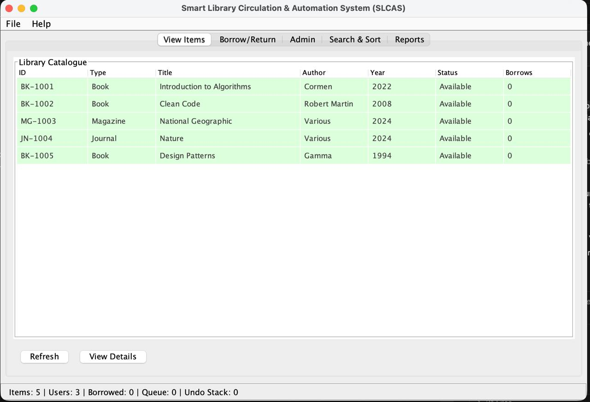
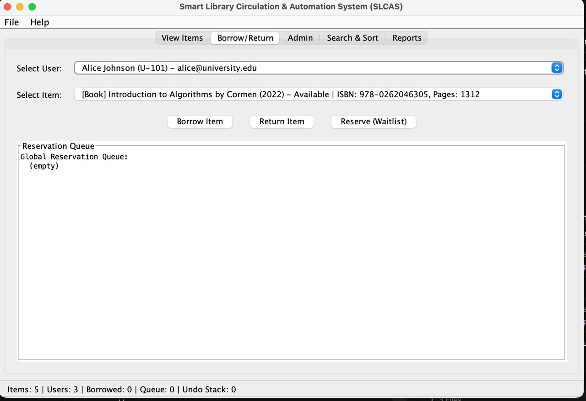
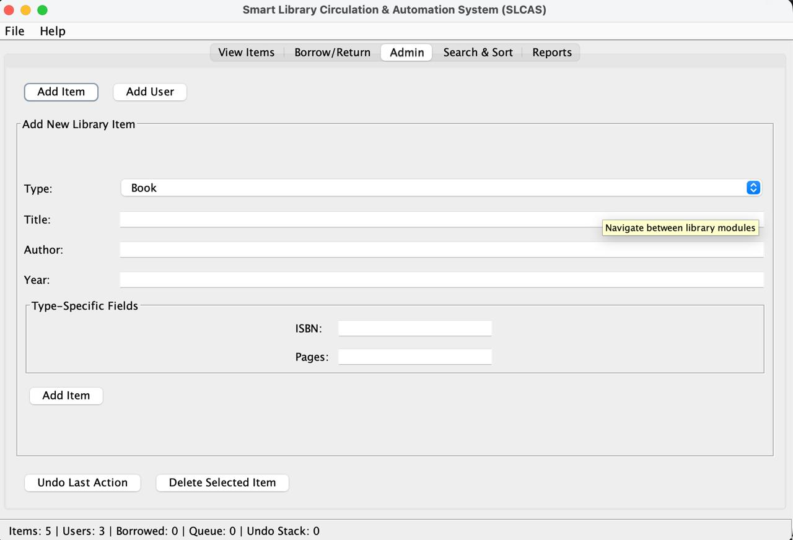
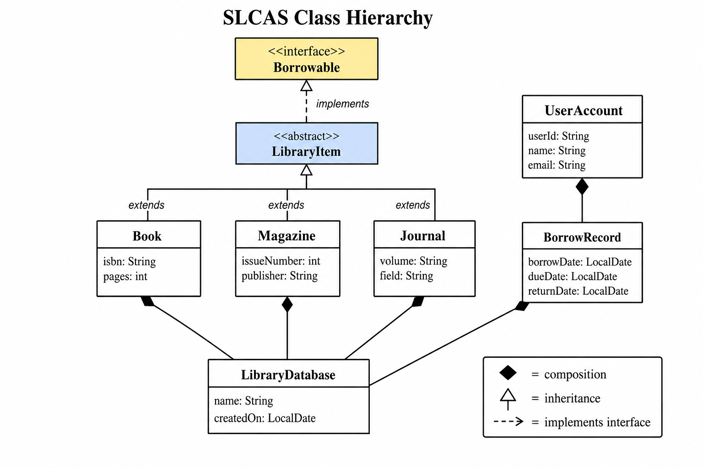
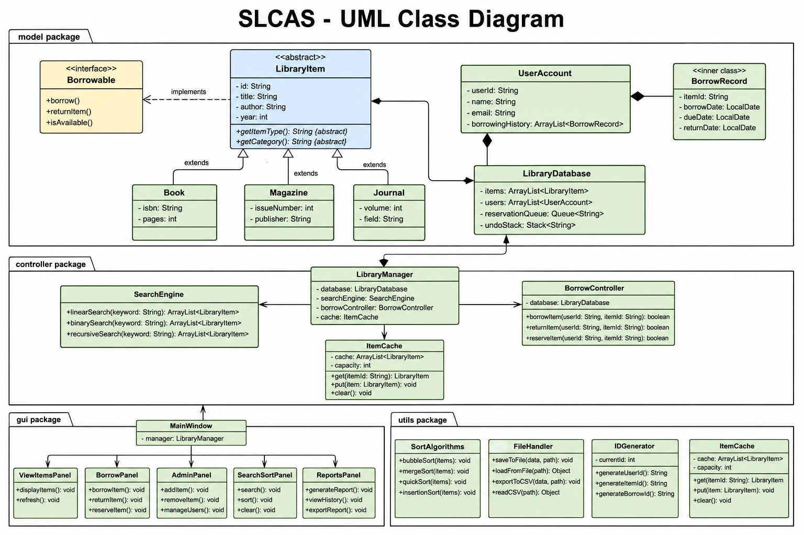

# Smart Library Circulation & Automation System (SLCAS)

A fully functional Java Swing desktop application built for **MIVA Open University**. The system manages library resources, user accounts, borrowing workflows, reservation queues, automated overdue reminders, and interactive GUI dashboards.

---

## Table of Contents

- [Overview](#overview)
- [Features](#features)
- [Project Structure](#project-structure)
- [Requirements Coverage](#requirements-coverage)
- [Data Structures & Algorithms](#data-structures--algorithms)
- [Screenshots](#screenshots)
- [UML Diagrams](#uml-diagrams)
- [Getting Started](#getting-started)
- [Usage Guide](#usage-guide)
- [Running Tests](#running-tests)
- [Design Decisions](#design-decisions)

---

## Overview

SLCAS (Smart Library Circulation & Automation System) is a library management application that demonstrates:

- **Advanced Object-Oriented Programming** — abstract classes, interfaces, inheritance, polymorphism, encapsulation, and composition
- **Efficient data structures** — ArrayList, Queue, Stack, and a fixed-size array cache
- **Student-implemented algorithms** — linear/binary/recursive search; selection, insertion, merge, and quick sort
- **Recursion** — overdue charge calculation, category counting, and recursive catalogue search
- **Event-driven GUI programming** — Swing panels, listeners, timers, dialogs, and layout managers
- **File persistence** — save and load library data as JSON text files

The application loads with sample data (5 library items and 3 users) so it can be demonstrated immediately after launch.

---

## Features

| Feature | Description |
|---|---|
| **View Items** | Browse the full catalogue in a colour-coded table (green = available, yellow = borrowed, red = overdue) |
| **Borrow / Return** | Check items out for 14 days, return them, and join a FIFO reservation waitlist |
| **Admin Panel** | Add books, magazines, and journals with dynamic type-specific fields; undo last admin action |
| **Search & Sort** | Search by title, author, or type; sort by title, author, or year using a selectable algorithm |
| **Reports** | Most borrowed items, overdue users, category distribution, and access cache report |
| **Save / Load** | Export and import `items.json` and `users.json` via a file chooser dialog |
| **Overdue Timer** | Background timer checks every 30 seconds and updates the status bar when items are overdue |

---

## Project Structure

```
miva-project/
├── src/
│   ├── model/              # Domain classes and data store
│   │   ├── Borrowable.java         Interface for borrowable items
│   │   ├── LibraryItem.java        Abstract base class
│   │   ├── Book.java               Subclass
│   │   ├── Magazine.java           Subclass
│   │   ├── Journal.java            Subclass
│   │   ├── UserAccount.java        User with borrowing history
│   │   └── LibraryDatabase.java    Central data store (ArrayList, Queue, Stack)
│   ├── controller/         # Business logic
│   │   ├── LibraryManager.java     Facade — coordinates all operations
│   │   ├── SearchEngine.java       Linear, binary, recursive search
│   │   └── BorrowController.java   Borrow, return, waitlist queue
│   ├── gui/                # Swing user interface
│   │   ├── MainWindow.java         Main frame with tabbed panels
│   │   ├── ViewItemsPanel.java
│   │   ├── BorrowPanel.java
│   │   ├── AdminPanel.java
│   │   ├── SearchSortPanel.java
│   │   ├── ReportsPanel.java
│   │   └── LibraryTableRenderer.java  Custom table cell renderer
│   └── utils/              # Helpers
│       ├── SortAlgorithms.java     Selection, insertion, merge, quick sort
│       ├── ItemCache.java          Fixed-size array cache (10 slots)
│       ├── FileHandler.java        JSON save/load
│       └── IDGenerator.java        Unique ID generation
├── tests/                  # Unit test suite (39 tests)
├── docs/                   # UML diagrams
├── screenshots/            # GUI screenshots for submission
├── run.sh                  # Compile and launch the GUI
└── run-tests.sh            # Compile and run all tests
```

---

## Requirements Coverage

| Requirement | Implementation |
|---|---|
| Abstract class `LibraryItem` | `src/model/LibraryItem.java` |
| Subclasses Book, Magazine, Journal | `src/model/Book.java`, `Magazine.java`, `Journal.java` |
| Interface `Borrowable` | `src/model/Borrowable.java` |
| Polymorphism | `LibraryManager.processItem()` — handles any `LibraryItem` subtype |
| Encapsulation & composition | `LibraryDatabase` contains items/users; `UserAccount` contains borrow history |
| Multiple packages | `model`, `controller`, `gui`, `utils` |
| ArrayList | Stores library items and users |
| Queue | Reservation / waitlist (FIFO) |
| Stack | Undo last admin operation (LIFO) |
| Array | `ItemCache` — 10-slot fixed-size cache for most accessed items |
| Linear search | `SearchEngine.linearSearchByTitle/Author()` |
| Binary search | `SearchEngine.binarySearchByTitle()` — used when list is sorted by title |
| Recursive search | `SearchEngine.recursiveSearchByTitle()` |
| Selection / Insertion / Merge / Quick sort | `SortAlgorithms` — selectable from GUI dropdown |
| Recursion | Overdue charge, category count, recursive search |
| GUI tabs | View Items, Borrow/Return, Admin, Search & Sort, Reports |
| Advanced GUI | Custom renderer, dynamic fields, file chooser, timer, validation, tooltips, mnemonics |
| Persistence | JSON files via `FileHandler` |
| Reports | Most borrowed, overdue users, category distribution |

---

## Data Structures & Algorithms

### Data Structures

| Structure | Where Used | Purpose |
|---|---|---|
| **ArrayList** | `LibraryDatabase` | Store all library items and user accounts |
| **Queue** | `BorrowController` | FIFO reservation waitlist — first reserved, first served |
| **Stack** | `LibraryDatabase` | LIFO undo stack for admin add/delete operations |
| **Array** | `ItemCache` | Fixed-size cache tracking the 10 most frequently accessed items |

### Search Algorithms

| Algorithm | When Used | Time Complexity |
|---|---|---|
| **Linear search** | Default; unsorted lists; partial matches | O(n) |
| **Binary search** | After sorting by title; exact title lookup | O(log n) |
| **Recursive search** | Selected from GUI; partial title match | O(n) |

### Sort Algorithms

All four are implemented in `SortAlgorithms.java` and selectable from the Search & Sort tab:

| Algorithm | Best For |
|---|---|
| **Selection Sort** | Simple, easy to trace — O(n²) |
| **Insertion Sort** | Nearly sorted data — O(n²) |
| **Merge Sort** | Stable, consistent performance — O(n log n) |
| **Quick Sort** | Fast average case — O(n log n) |

### Recursive Algorithms

1. **Overdue charge** — `$0.50` per day; recurses one day at a time until the due date is reached
2. **Category count** — walks the item list recursively to count books, magazines, and journals
3. **Recursive search** — searches the catalogue by recursing through the list index by index

---

## Screenshots

### View Items — Library Catalogue



### Borrow / Return — Checkout & Reservation Queue



### Admin — Add Item with Dynamic Fields



---

## UML Diagrams

### Class Hierarchy (OOP)



### Full System Class Diagram



<details>
<summary>PlantUML source files</summary>

| File | Description |
|---|---|
| `docs/uml-hierarchy.puml` | PlantUML source (hierarchy) |
| `docs/uml-class-diagram.puml` | PlantUML source (full diagram) |

</details>

---

## Getting Started

### Prerequisites

- **Java 17 or higher** (the project uses switch expressions and pattern matching)

### Run the Application

```bash
cd miva-project
./run.sh
```

### Manual Compile & Run

```bash
export JAVA_HOME=/Library/Java/JavaVirtualMachines/jdk-23.jdk/Contents/Home
mkdir -p out
javac -d out $(find src -name "*.java")
java -cp out gui.MainWindow
```

---

## Usage Guide

### View Items
Browse the full catalogue. Click **View Details** on a selected row to see type-specific information (ISBN for books, issue number for magazines, etc.).

### Borrow / Return
1. Select a **user** and an **item** from the dropdowns
2. Click **Borrow Item** — the loan period is 14 days
3. If the item is already borrowed, the user is automatically added to the waitlist
4. Click **Return Item** to return; the next waitlisted user receives the item automatically

### Admin
1. Choose **Add Item** or **Add User**
2. Select item type (Book / Magazine / Journal) — extra fields appear dynamically
3. Fill in the form and click **Add Item** or **Add User**
4. Use **Undo Last Action** to reverse the most recent admin operation
5. Select an item in View Items, then click **Delete Selected Item** to remove it

### Search & Sort
1. Enter a search query and choose the search type (Linear, Binary, Recursive, Author, Type)
2. Click **Search**
3. To sort, pick a field (Title / Author / Year) and algorithm, then click **Sort All Items**

### Reports
- **Most Borrowed Items** — ranked by borrow count
- **Overdue Users** — users with items past their due date and calculated charges
- **Category Distribution** — count of books, magazines, and journals
- **Save Data / Load Data** — export or import JSON files to a chosen folder

---

## Running Tests

The project includes **39 unit tests** with no external dependencies (no JUnit required):

```bash
./run-tests.sh
```

| Test Class | Coverage |
|---|---|
| `SearchEngineTest` | Linear, binary, recursive search; search by type |
| `SortAlgorithmsTest` | Selection, insertion, merge, quick sort correctness |
| `BorrowControllerTest` | Borrow, return, waitlist queue, auto-assign on return |
| `ItemCacheTest` | Fixed-size array cache access tracking |
| `LibraryManagerTest` | Undo stack, recursive charge/count, polymorphic processing |

---

## Design Decisions

**Why Merge Sort as the default recommendation?**  
Merge sort guarantees O(n log n) performance regardless of input order and is stable (preserves relative order of equal elements), making it reliable for catalogue sorting before binary search.

**Why a Stack for undo?**  
Admin operations are reversed in last-in-first-out order, which matches natural user expectation — undoing the most recent action first.

**Why a Queue for reservations?**  
Library waitlists are fair: the first person to reserve an item should receive it first when it is returned (FIFO).

**Why JSON for persistence?**  
Human-readable text files are easy to inspect, debug, and submit as part of the project without requiring a database.

**Package separation**  
The four-package layout (`model`, `controller`, `gui`, `utils`) keeps domain logic independent of the UI, making the system easier to test and maintain.

---

## Author

MIVA Open University — Software Engineering / Java Programming Project

© 2025 MIVA Open University. All Rights Reserved.
