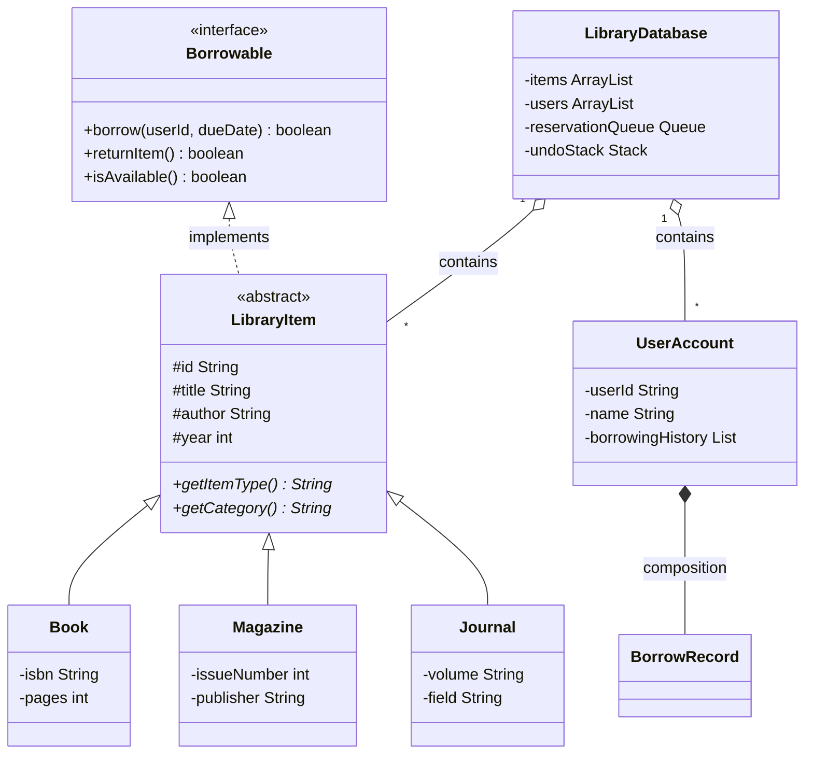
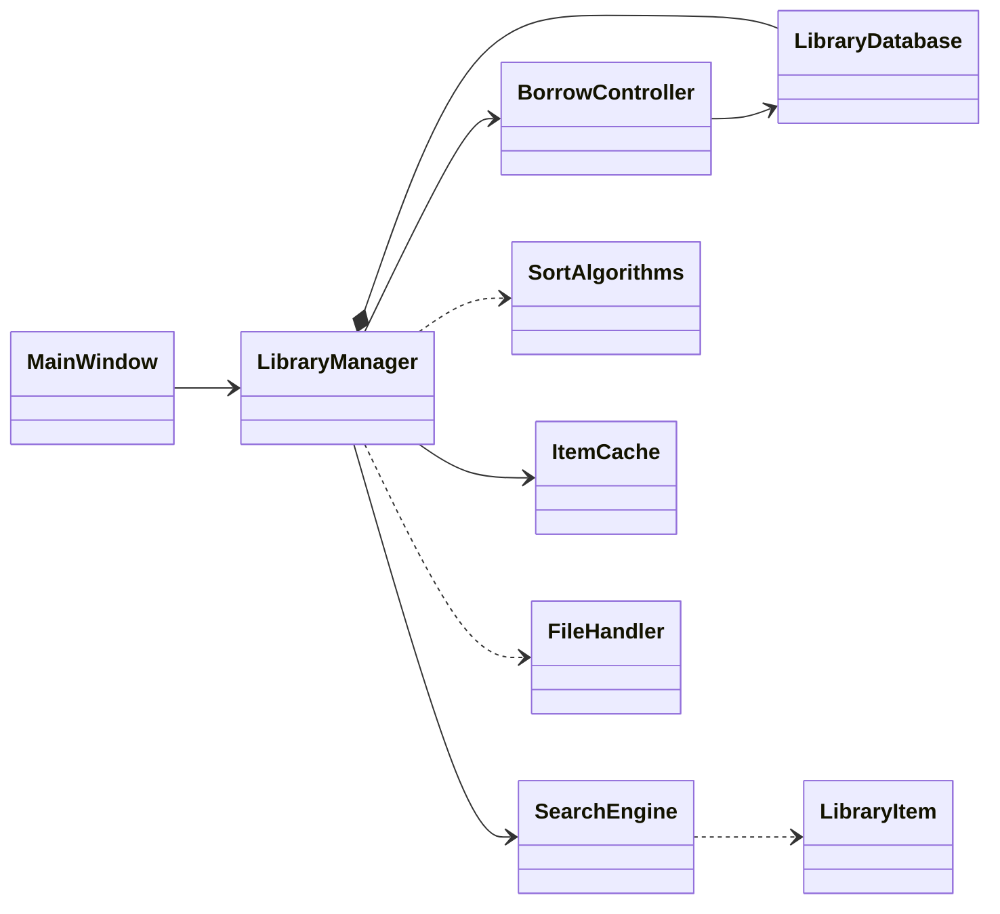

# SLCAS UML Diagrams

Two PlantUML diagrams are included for your submission.

| File | Purpose |
|---|---|
| `uml-hierarchy.puml` | **Class hierarchy** — abstract class, subclasses, interface, composition |
| `uml-class-diagram.puml` | **Full system diagram** — all packages, controllers, GUI, utils |

## How to export as PNG/PDF (for submission)

### Option 1 — Online (easiest)
1. Open [https://www.plantuml.com/plantuml/uml](https://www.plantuml.com/plantuml/uml)
2. Paste the contents of `uml-class-diagram.puml` (or `uml-hierarchy.puml`)
3. Download PNG or SVG

### Option 2 — VS Code / Cursor
1. Install the **PlantUML** extension
2. Open a `.puml` file
3. Press `Alt+D` (or `Option+D` on Mac) to preview
4. Export from the preview panel

### Option 3 — Command line
```bash
# Install PlantUML (requires Java)
brew install plantuml

# Generate PNGs
plantuml docs/uml-hierarchy.puml
plantuml docs/uml-class-diagram.puml
```

Output files: `docs/uml-hierarchy.png` and `docs/uml-class-diagram.png`

---

## Mermaid preview (GitHub / Markdown viewers)

### Class hierarchy



### System architecture



---

## Key relationships to mention in your report

1. **Inheritance** — `Book`, `Magazine`, `Journal` extend abstract `LibraryItem`
2. **Interface** — `LibraryItem` implements `Borrowable`
3. **Polymorphism** — `processItem(LibraryItem)` dispatches on runtime type
4. **Composition** — `LibraryDatabase` owns collections of items and users; `UserAccount` owns `BorrowRecord` list
5. **Dependency** — GUI panels depend on `LibraryManager`; controllers depend on `LibraryDatabase`
